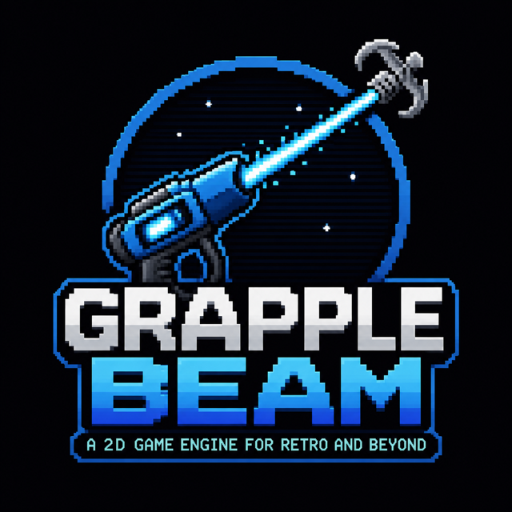

<div align="center">

# grapple-beam

**Everything a 2D game needs, pulled into one self-contained binary.**

*A static-first game engine on SDL3, scriptable in Lua and Ruby.*

[](https://github.com/bluesentinelsec/grapple-beam/actions/workflows/ci.yml)
[](LICENSE)
&nbsp;·&nbsp; **[Documentation](https://bluesentinelsec.github.io/grapple-beam/)** ·
[Getting Started](https://bluesentinelsec.github.io/grapple-beam/getting-started.html) ·
[Modules](https://bluesentinelsec.github.io/grapple-beam/modules.html)

</div>

---

<div align="center">
  
</div>

SDL3 gives you a window, a renderer, input, and audio output — and then the
dependency hunt begins: a mixer, an image loader, fonts, physics, a GUI, a
data-format parser, an archive format, a scripting language. Each usually
arrives as another shared library with its own transitive dependencies and
its own packaging story on every platform.

This project takes the opposite approach. **Every extension is vendored as
pinned source and compiled into a static library.** Your game links a
handful of `Grapple::*` CMake targets and produces one self-contained
executable — no DLLs beside the binary, no `LD_LIBRARY_PATH`, no "works on
my machine." The same tree builds for Linux, macOS, Windows, Android, iOS,
and browser WebAssembly, and CI proves all of it on every push.

## The stack

| Need | Module | Under the hood |
|------|--------|----------------|
| Audio: mixing, music, SFX, MIDI, chiptunes | `Grapple::Mixer` | SDL3_mixer 3.2.4 + vendored codecs, TiMidity, original MML synth |
| 2D drawing primitives | `Grapple::Gfx` | SDL3_gfx + original GPU-batched equivalents |
| Image loading/saving (13 formats) | `Grapple::Image` | SDL3_image, all-static codecs |
| Text and fonts, i18n shaping + BiDi | `Grapple::TTF` | SDL3_ttf + static FreeType, HarfBuzz, SheenBidi |
| TCP/UDP networking | `Grapple::Net` | SDL3_net |
| HTTP/S client + embedded server | `Grapple::Http` / `mog::mog` | [mog](https://github.com/bluesentinelsec/mog), statically linked |
| Rigid-body physics | `Grapple::Physics` | Box2D v3 (pure C11) |
| Immediate-mode GUI | `Grapple::GUI` | Nuklear + SDL3 backend + weighted grid layout |
| Tiled map parsing (.tmj) | `Grapple::Tiled` | cute_tiled, VFS-aware |
| Regular expressions | `Grapple::Regex` | Oniguruma (Ruby syntax) in C, C++, Lua and Ruby |
| Dynamic 2D lighting | `Grapple::Light` | GPU shader (embedded GLSL), day/night, shadows, CPU fallback |
| Opinionated game engine | `Grapple::Engine` | fixed-tick loop with interpolated rendering, design-resolution scaling |
| Virtual filesystem, encrypted archives | `Grapple::VFS` | PhysFS (zip-only) + SSE1 crypto container |
| Crypto, DEFLATE, base64, signals | `Grapple::Extras` | original code + sdefl/sinfl |
| JSON / TOML / YAML | `Grapple::Formats` | cJSON, tomlc99, libyaml |
| Embedded scripting | `Grapple::Lua` / `Grapple::Ruby` | Lua 5.4.8, mruby 4.0.0, require-from-zip |
| Script game API (both languages) | `Grapple::Bindings` | curated layer + generated full-API mirror |
| C++ RAII bindings | `Grapple::Cpp` | Google-style, `Status`/`Result`, no exceptions |

## Quick start

```cmake
include(FetchContent)
FetchContent_Declare(grapple
  GIT_REPOSITORY https://github.com/bluesentinelsec/grapple-beam.git
  GIT_TAG        v0.2.0)
FetchContent_MakeAvailable(grapple)

add_executable(my_game main.c)
target_link_libraries(my_game PRIVATE SDL3::SDL3 Grapple::Mixer Grapple::Gfx)
```

Link only what you use; switch whole modules off with
`set(GRAPPLE_BUILD_<NAME> OFF)` before `MakeAvailable`. Full walkthrough:
[Getting Started](https://bluesentinelsec.github.io/grapple-beam/getting-started.html).

To hack on the repository itself:

```bash
cmake -B build/debug -DCMAKE_BUILD_TYPE=Debug
cmake --build build/debug --parallel
ctest --test-dir build/debug
```

## Write your game in C, C++, Lua, or Ruby

The whole stack is exposed on four language surfaces — [`demos/`](demos/)
contains a complete Pong in each as living proof:

- **C** — the native API of every module.
- **C++** — Google-style RAII wrappers (`grapple::Window`,
  `grapple::Mixer`, …) with `Status`/`Result` error handling and no
  exceptions, plus a generated surface covering every C function:
  RAII owners for 60+ resource types, `Status` wrappers, aliases.
  [Details](https://bluesentinelsec.github.io/grapple-beam/cpp.html).
- **Lua & Ruby** — embedded runtimes with a curated game API plus a
  generated mirror of the entire C API (2,156 functions per language,
  GC-safe ownership), `require` working from mounted (optionally
  encrypted) zip archives, and an interactive REPL (`repl -l lua|ruby`).
  [Details](https://bluesentinelsec.github.io/grapple-beam/scripting.html).

## Ship your assets sealed

```bash
python3 scripts/pack_assets.py assets/ media.bin --password "secret" \
        --header media.h --symbol game_media
```

```c
Grapple_MountEncryptedArchive(game_media, (int)game_media_len, "secret", "/assets");
SDL_Surface *hero = IMG_Load_IO(Grapple_OpenVFSRead("/assets/hero.png"), true);
```

Textures, audio, maps, and scripts all load transparently from the mounted
archive — ChaCha20 + PBKDF2 encrypted, authenticated before mounting.

## Engineering discipline

- **Pinned and ledgered.** Every vendored library is imported at a
  specific release with its SHA-256 recorded; all local changes are
  documented in [`deps/`](deps/) (12 upstream bugs found, fixed locally,
  and written up so far).
- **Delete, don't stub.** Features that would require shared libraries
  are removed from the headers — misuse fails at compile time, never at
  runtime.
- **Tested where it runs.** 319 tests on six CI platforms (Linux, macOS,
  Windows, ASan+UBSan, Android emulator, browser WebAssembly) plus an
  iOS XCFramework batch job, with a link audit proving every test binary
  depends only on OS-built-in shared libraries.
- **Generated code is verified.** The binding generator's committed
  output is regenerated in CI and must match byte-for-byte.

## Versioning

[Semantic versioning](https://semver.org/). Until 1.0.0, minor releases
may include breaking API changes; release notes will always say so.

## License

zlib for all original code. Vendored components keep their own permissive
licenses (zlib, MIT, public domain) — see [`deps/`](deps/) for the
complete inventory.
