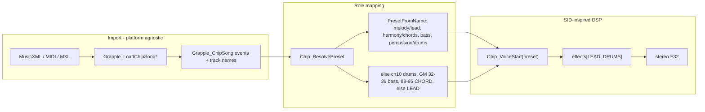
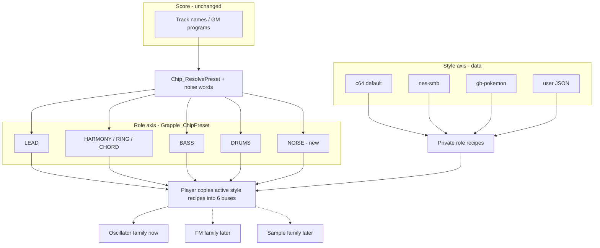
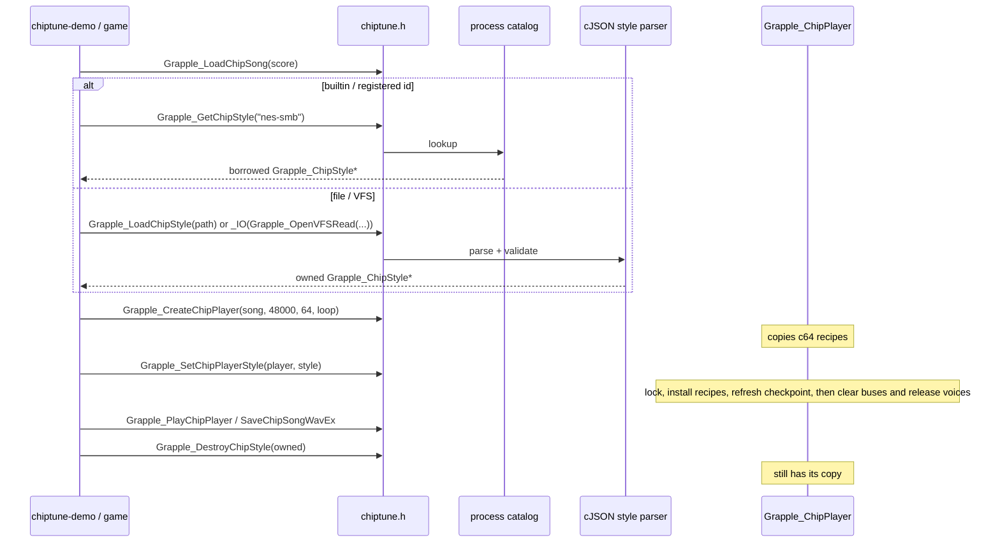
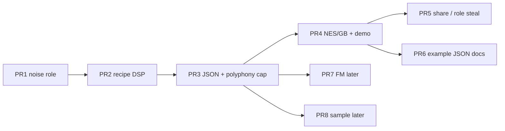

# User-authored chiptune styles and named default palettes

| Field | Value |
| --- | --- |
| **Author** | Grapple-beam contributors |
| **Date** | 2026-09-22 |
| **Status** | Draft |
| **Audience** | Mixer / chiptune owners, bindgen, demo, and docs reviewers |
| **Primary code** | `modules/mixer/` (`include/grapple/chiptune.h`, `src/chip_player.c`, `src/chip_voice.c`, `src/chip_effects.c`, `src/chip_mix.c`, `src/chip_transport.c`, `src/chip_song.c`) |
| **Tests** | `tests/mixer/` |
| **Demos** | `demos/chiptune/` |

---

## Overview

Grapple already imports MusicXML / MIDI / MXL in a platform-agnostic score model (`Grapple_LoadChipSong*`) and plays it through a SID-inspired polyphonic renderer whose *roles* (lead, harmony, bass, drums) are a single enum, `Grapple_ChipPreset`. Timbre, envelopes, and effect buses are hard-wired to that enum in `Chip_VoiceStart` / `Chip_VoiceSampleMotion` and `Grapple_ChipPlayer.effects[GRAPPLE_CHIP_PRESET_DRUMS + 1]`. There is no way to select “this score, but as a Game Boy” without forking DSP or exploding the enum into platform × role hybrids.

This design splits **style/palette** (a data document: C64 default, shipped named palettes, or a user JSON file) from **role** (five performance tracks). The score mapper keeps resolving parts onto roles. A **private** per-role recipe is rich enough to transcribe today’s `chip_voice.c` (oscillator mix, analog vs NES triangle, continuous pulse duty, LFO/PWM, SVF filter mode, ring ratio, GM drum kit, release used at note-off). Public C is an opaque `Grapple_ChipStyle` plus `Grapple_ChipStyleInfo`. Built-in palettes ship as JSON sources compiled into C so the C64 default remains bit-identical until a style is selected. Users add Apple II + Mockingboard, Atari, Game Gear, and similar oscillator machines by writing JSON — no engine release — once the named voice family exists. Genesis-class FM and SNES/Amiga/DOS-PCM wait for later voice-family PRs and are **not** in the v1 builtin catalog.

---

## Background & Motivation

### Current pipeline (verified)



Facts from the tree:

- Import lives in `modules/mixer/src/chip_musicxml.c`, `chip_midi.c`, `chip_score_*.c`. It does not know about SID, NES, or any machine. That must stay true.
- Public roles are `Grapple_ChipPreset` in `modules/mixer/include/grapple/chiptune.h`: `AUTO`, `LEAD`, `BASS`, `CHORD`, `RING`, `DRUMS`, with `HARMONY = RING`.
- `PresetFromName` in `modules/mixer/src/chip_player.c` (lines 71–99) matches whole words: `melody`/`lead`, `harmony`/`chords`, `bass`, `percussion`/`percussions`/`drums`. **There is no noise / effects role.** Track names are stored in `Grapple_ChipTrackInfo.name[128]` (127 bytes + NUL at import); `PresetFromName` walks the whole stored name.
- `Grapple_ChipPlayer` allocates one shared `ChipEffectBus` per preset (`effects[GRAPPLE_CHIP_PRESET_DRUMS + 1]`, loops `LEAD..DRUMS`). Private per-part buses are capped at 32 (`Grapple_SetChipTrackEffects`). Adding “NES lead” as more enum values would mix platform × role and grow buses linearly.
- `Chip_VoiceStart` / `Chip_VoiceSampleMotion` in `chip_voice.c` hard-code SID-ish timbres: PWM pulse lead, filtered pulse+saw bass, pulse pad vs ring-mod **analog** triangle, GM-mapped analog drums, SVF on every sample. This is **not** the MML path and does **not** use `Grapple_ChipWave`.
- A separate offline API in `grapple_chiptune.c` already has `Grapple_ChipWave` (12.5/25/50% pulse, 16-step NES triangle, saw, 15-bit LFSR, metallic short-loop LFSR, sine). The streaming MusicXML player does not use it. NES / Game Boy *can* be approximated by teaching the player those oscillators **additively** (continuous pulse duty plus a staircase triangle *mode*, not by snapping C64 PWM to the MML enum).
- Default polyphony for helpers is **64** voices (`Grapple_PlayChipFile` / `Grapple_CreateChipPlayer`); the legal range is 1–1024. Real 2A03 / DMG / SID hardware is 3–5 channels. Unlimited polyphony will not “sound like” those machines. Today `StartNote` fills the **allocated** pool first; a style `polyphony` cap must steal *before* taking a free slot.
- Seek/loop reconstruction (`AdvanceVoices` in `chip_transport.c`) already disagrees with live DSP (mod `cycles * 1.5` vs live `step * 2.0`; LFO 5 Hz vs 5.2 Hz). Recipe-driven LFO/ring must drive **both** paths or identity and seek tests drift.
- Docs already disclaim emulation: `docs/chiptune-support.md` (“sound palette rather than an emulator”), `modules/mixer/README.md` (“SID-inspired sound design, not cycle-exact 6581/8580”).
- Bindings are generated (`tools/bindgen/spec.py` ownership table for `Grapple_ChipSong` / `ChipPlayer` / `ChipComposer`). New opaque types need a create/destroy pair listed there; sized buffers (`Load*Memory`) stay C/C++-only per `classify.py`. Lua/Ruby enum constants for `GRAPPLE_CHIP_PRESET_*` are committed in `modules/bindings/generated/gen_lua_grapple.c` / `gen_ruby_grapple.c`.
- `cmake/ChiptuneMinimal.cmake` builds **mixer only**, with `GRAPPLE_BUILD_FORMATS=OFF` and `GRAPPLE_BEAM_WITH_JSON=OFF`. Android / iOS / Emscripten force **nlohmann** off (`GRAPPLE_BEAM_WITH_JSON`), not Formats. Mixer is added in `modules/CMakeLists.txt` **before** formats, so it cannot `PRIVATE` link `Grapple::Formats` today. `Grapple::Formats` is cJSON **plus** tomlc99 **plus** libyaml. The synthesis core must remain C, with no C++ runtime and no nlohmann (`docs/chiptune-validation.md`).

### Pain points

1. One enum is both *performance role* and *C64 timbre*. Selecting another machine cannot be “more presets.”
2. Users who want Apple II / Amiga / Atari / Game Gear cannot author a palette without a C change.
3. Named game-inspired palettes (NES platformer, GB RPG, Genesis action, SNES adventure, DOS PC) do not exist, and shipping ROM/NSF/SPC/VGM rips would be an IP defect.
4. Scores with a dedicated SFX/noise part have nowhere to map except drums or lead.

---

## Goals & Non-Goals

### Goals

1. **Two axes:** style/palette × the five roles. Do not grow `Grapple_ChipPreset` into 25 platform-role hybrids.
2. **User styles are data.** A documented JSON format a non-core-developer can write: `id`, display name, per-role recipes, optional channel limits, effects, optional sample-pack references. Load from a path, `SDL_IOStream` / VFS, or catalog id. Validate loudly (`SDL_SetError` with a JSON field path). User JSON is available in the mixer-only music SDK (cJSON compiled into mixer; not gated on `GRAPPLE_BUILD_FORMATS`).
3. **Ship named default palettes** as first-class files (JSON source + compiled-in C) using *original* synthesis inspired by those games’ **hardware and arrangement conventions**. v1 builtins: `c64`, `nes-smb`, `gb-pokemon` only.
4. **C64 remains the default.** `Grapple_CreateChipPlayer` / `PlayChipFile` / `SaveChipSongWav` and existing tests stay PCM-identical until a style is selected.
5. **Easy creation:** minimal example file, schema, demo flag, Lua/Ruby/C/C++ selection. Document what a user can express today vs after FM/sample voices.
6. **Voice families as an extension point:** `oscillator` now; `fm` and `sample` later. Style files name a kind; unknown/unimplemented kinds fail at load, not at the audio callback.
7. **Noise / effects role** in the name mapper and as a sixth shared effect bus.
8. **Optional hardware channel / mix constraints** so “sounds like NES” includes crowding, not just pulse duty. Global `polyphony` is honored **before** NES/GB JSON ships.
9. **C ABI** in `chiptune.h`; bindgen C++ / Lua / Ruby follow. Logic stays in `modules/mixer`; tests in `tests/mixer`; Doxygen on public symbols; explicit CMake sources.

### Non-goals

- Cycle-exact chip emulation, SID ROMs, NSF/SPC/VGM/AY players, or GME (already deleted from mixer).
- Licensed Nintendo / Sega / Pokémon Company / id Software soundtracks, samples, or official recreation claims.
- Replacing MusicXML import, Guitar Pro role-word contract, or the composer API.
- Making the offline MML/`Grapple_CreateChipTone` path style-aware in the first implementation (it already exposes raw waves; a later PR may share oscillator code). `Grapple_ChipWave` is not the streaming DSP mode.
- A `grapple-beam` runner subcommand for music. Playback remains library + `chiptune-demo` / `grapple-beam run demos/chiptune/play.lua`.
- Unlimited authentic polyphony. Style channel caps are the feature; 64–1024 remains the *engine* ceiling.
- FM (YM2612 / OPL2) and sample/wavetable (SPC700 / Paula / DOS Blaster PCM) DSP in the first implementation PR.
- Shipping Genesis / SNES / DOS ids as pulse sketches in the v1 builtin catalog.
- A public frozen `Grapple_ChipRoleRecipe` POD in `chiptune.h`.

---

## Key Decisions

| Decision | Choice | Rationale |
| --- | --- | --- |
| Axes | Style (document) × role (`Grapple_ChipPreset`) | Roles already drive mapping, buses, and `SetChipTrackPreset`. Styles re-skin roles. New machines must not add enum values per machine. |
| Default style | Compiled-in `c64`, applied at `Grapple_CreateChipPlayer` | Existing demos, `SaveChipSongWav`, PCM tests, and `PlayChipFile` stay unchanged. |
| Role enum | Keep `Grapple_ChipPreset`; append `GRAPPLE_CHIP_PRESET_NOISE` | Inserting in the middle would reorder buses and break ABI. `HARMONY` remains an alias of `RING`. `CHORD` vs `RING` stay C64 timbre slots, not user-facing roles. |
| User-facing roles | Five: lead, harmony, bass, drums, noise | Product constraint. `CHORD` is the GM-pad fallback recipe (optional style key `chord`, default = copy of harmony **without** an extra hardware channel). |
| Recipe ABI | **Private** `ChipRoleRecipe` in `chip_style.h`. Public: opaque `Grapple_ChipStyle` + `Grapple_ChipStyleInfo` | FM/sample/drum maps would break a public POD and script marshal. Games construct styles from JSON, not by filling 20 fields. |
| Recipe richness | Mix weights, triangle mode, continuous duty, LFO Hz + vibrato delay, filter mode + env amount, ring ratio, drum program, `release_ms` on note-off | Anything less cannot transcribe `chip_voice.c`; C64 PCM identity would be unimplementable. |
| Streaming oscillator | Continuous `duty` + triangle mode + noise type. Do **not** snap to `Grapple_ChipWave` | Player already uses PolyBLEP PWM (lead centers on 0.30). MML enum is 12.5/25/50% steps. Both NES duties and C64 PWM share one oscillator. |
| Style lifetime | Player **copies** recipes on `SetChipPlayerStyle` | Callers may destroy a loaded style immediately. Builtins are process-lifetime. |
| Style apply | Lock; install recipes; `Chip_RefreshCheckpoint` if looping; **on failure restore recipes+checkpoint and leave voices**; on success clear buses then release voices | Checkpoint alloc can fail. Releasing voices first cannot be rolled back (`SetChipTrackPreset` mutates then checkpoints). |
| Selection scope | **Per-player** apply; process catalog for discovery only | Tests and games run multiple players. |
| Catalog threads | **Not thread-safe.** Main/load thread only, same as import | Mixer has no process mutex; `SDL_LockAudioStream` is per-player. |
| JSON runtime | **Not nlohmann. Not `Grapple::Formats`.** Mixer PRIVATE-links **STATIC** `Grapple_CJson` (`Grapple::CJson`) from `cJSON.c`. Always on when mixer is on. SDK fold-in via `Grapple_` prefix; not in `GRAPPLE_SDK_VENDORED` | Mixer CMake runs before formats; Formats also pulls YAML/TOML. nlohmann is the C++ CLI stack and is off on Android/iOS/web. Formats is **not** off on those platforms. ChiptuneMinimal can still load user JSON. |
| Builtin shipping | JSON in `modules/mixer/styles/*.json` → checked-in `chip_styles_builtin.c` | Minimal cross-builds must not run Python/codegen (`docs/chiptune-validation.md`). Freshness test like bindgen. |
| v1 builtins | `c64`, `nes-smb`, `gb-pokemon` only | Oscillator-honest. Genesis/SNES/DOS wait for FM/sample PRs so `--list-styles` never teaches a pulse trio as “Sonic.” |
| Channel limits | Optional; **ON** for NES/GB files; **OFF** for `c64`. Global `polyphony` implemented in the JSON/API PR **before** those files ship | Today `StartNote` uses free allocated slots; a JSON cap is a no-op until steal runs first. |
| `share` / `steal` | Parsed and stored in schema 1 (PR 3); `StartNote` ignores them until PR 5 | Unknown keys are errors; do not force a schema bump. |
| Minimal JSON inherit | Copy C64 **role**, then if `oscillator`/`wave`/`mix` is present **replace** mix (zero other weights), `ring_ratio=0`, `drums=none`. Then overlay explicit fields. **Effects default to dry.** | A pulse shorthand on C64 RING must not keep `ring_ratio=2` or `gm-analog`. Inherit-all-including-wet would also make a four-key file sound like SID delay/chorus. |
| Filter | Recipe `filter`: `svf_low` / `svf_high` / `off`. C64 transcribes today’s SVF. NES/GB set `off` | Every live sample currently goes through the SVF (`chip_voice.c` 204–207). `cutoff_hz: 8000` still colors NES pulse. |
| Style vs master gain | `effective = clamp(master_gain * style_gain, 0, 2)` before the existing soft clip | Both are linear 0..2-ish; product then clamp matches `SetChipPlayerGain`’s documented range. C64 `gain: 1` × default master 1 is identity. |
| FM / sample | Later PRs; not sketched as builtins | Authentic YM2612 / SPC / OPL2 / Paula cannot be faked with pulse+noise. |
| Legal | Original palettes; internal ids `nes-smb` etc.; user-facing names include “inspired”; no dumps/rips | Trademarks in docs/UI labels are descriptive of *inspiration*, not affiliation. |
| Bindings | Opaque `Grapple_ChipStyle` with Load/Destroy; `GetChipStyle` is borrowed | Matches ChipSong ownership. `LoadChipStyleMemory` / `_IO` excluded from scripts like song IO. PR 1 bindgen regen is **mandatory** (new `NOISE` constant). |
| Logging | `SDL_SetError` / `SDL_GetError` in mixer; no spdlog in mixer | Mixer cannot take spdlog (optional C++ dep, off on mobile). Demos may print the error. |

---

## Proposed Design

### 1. Two axes



`Grapple_ChipPreset` remains the **role (and C64 timbre-slot) id** used by:

- `PresetFromName` / `Chip_ResolvePreset`
- `Grapple_SetChipTrackPreset` / `SetChipPart`
- shared effect buses and `Grapple_SetChipPresetEffects`
- `Grapple_ChipMapping.preset`

A **style** is not an enum. It is an immutable document that, for each role slot, provides a private recipe the voice DSP and effect bus consume.

Do **not** add `GRAPPLE_CHIP_PRESET_NES_LEAD`. NES lead is `{ style: nes-smb, role: LEAD }`.

### 2. Role mapper: add noise / effects

Extend `PresetFromName` in `chip_player.c`:

| Whole word (case-insensitive) | Preset |
| --- | --- |
| `melody`, `lead` | `LEAD` |
| `harmony`, `chords` | `HARMONY` (`RING`) |
| `bass` | `BASS` |
| `percussion`, `percussions`, `drums` | `DRUMS` |
| **`noise`, `sfx`, `fx`, `effect`, `effects`** | **`NOISE`** |

Matching rules unchanged: ASCII punctuation/whitespace separators, digits belong to words, first hit wins. Names are truncated to 127 UTF-8 bytes plus NUL at import (`Grapple_ChipTrackInfo.name`), same as today; `PresetFromName` walks the whole stored name. `Bassoon` still does not match `bass`. `Sound Effects` and `Sound-Effects` match `effects`. `FX_2` matches `fx`. **`Affection` is one word and does not match `effect`** (negative test, not a question).

MIDI / MusicXML fallback (no role word):

- channel 10 or `unpitched` → `DRUMS` (not noise; kits are drums)
- GM 32–39 → `BASS`
- GM 88–95 → `CHORD`
- else → `LEAD`

There is **no** GM program family for noise/SFX. That role is name- or override-only.

Enum append (ABI-safe):

```c
typedef enum Grapple_ChipPreset {
    GRAPPLE_CHIP_PRESET_AUTO = 0,
    GRAPPLE_CHIP_PRESET_LEAD,
    GRAPPLE_CHIP_PRESET_BASS,
    GRAPPLE_CHIP_PRESET_CHORD,
    GRAPPLE_CHIP_PRESET_RING,
    GRAPPLE_CHIP_PRESET_DRUMS,
    GRAPPLE_CHIP_PRESET_NOISE, /* new: noise / effects role */
    GRAPPLE_CHIP_PRESET_HARMONY = GRAPPLE_CHIP_PRESET_RING
} Grapple_ChipPreset;

#define GRAPPLE_CHIP_PRESET_FIRST GRAPPLE_CHIP_PRESET_LEAD
#define GRAPPLE_CHIP_PRESET_LAST  GRAPPLE_CHIP_PRESET_NOISE
```

Replace every `<= GRAPPLE_CHIP_PRESET_DRUMS` / `> DRUMS` bound and `effects[DRUMS + 1]` with `FIRST..LAST`. Verified call sites include `chip_player.c` (buses, `SetChipTrackPreset`, `SetChipPresetEffects`, render arrays), `chip_player.h`, `chip_mix.c` (`ReadChipTrackEffects`), `chip_effects.c`, `chip_song.c` (`Grapple_SetChipPart` line 223), `chip_transport.c` (bus loop ~146), tests, benches, and Doxygen on `AUTO`. PR 1 greps the tree for `PRESET_DRUMS` before merge.

`docs/chiptune-validation.md` today says “five shared synthesis effect buses”; it becomes **six** (LEAD, BASS, CHORD, RING, DRUMS, NOISE). AUTO is not a bus. Cost: one more ~1.6 MiB delay/reverb allocation at 48 kHz (same as an extra `Chip_EffectsInit`).

`Grapple_GetChipPresetEffects(NOISE)` returns dry, matching drums, until a style overrides it.

Tests: extend `ChipPlayer.RoleWordsMapMidiNamesBeforeChannelAndProgramDefaults` with `Noise`, `SFX`, `[effects]`, `FX_2`, `Sound-Effects`, and negative `Affection`. Composer/player: `SetChipPart` / `SetChipTrackPreset(..., NOISE)` succeed; values above `LAST` still fail.

### 3. Style data model (public vs private)

JSON is the interchange format. The **runtime** recipe is C, but it is **not** a public ABI in `chiptune.h`. FM/sample PRs will add operators, sample-pack refs, and drum maps; a public POD would break C ABI and script marshal. Alternative D (hand-filled structs) stays a private/testing back door.

Public (`chiptune.h`):

```c
typedef enum Grapple_ChipVoiceKind {
    GRAPPLE_CHIP_VOICE_OSCILLATOR = 0,
    GRAPPLE_CHIP_VOICE_FM,     /* load fails until the FM engine exists */
    GRAPPLE_CHIP_VOICE_SAMPLE  /* load fails until the sample engine exists */
} Grapple_ChipVoiceKind;

typedef struct Grapple_ChipStyleInfo {
    char id[64];
    char name[128];
    char description[256];
    Grapple_ChipVoiceKind voice;
    int polyphony;      /* 0 = use CreateChipPlayer's voice_count */
    bool builtin;
    bool approximation; /* true when this file is not the target chip family */
} Grapple_ChipStyleInfo;

typedef struct Grapple_ChipStyle Grapple_ChipStyle;
```

Private (`chip_style.h`). This is the mechanical transcription target for `c64` — every live constant in `chip_voice.c` / `Chip_VoiceRelease` has a field:

```c
typedef enum ChipTriangleMode {
    CHIP_TRIANGLE_ANALOG = 0, /* 1 - 4*|phase-0.5|, C64 RING carrier today */
    CHIP_TRIANGLE_NES         /* 32-step / 16-level staircase; additive, not a C64 change */
} ChipTriangleMode;

typedef enum ChipFilterMode {
    CHIP_FILTER_SVF_LOW = 0, /* current non-hat path: mix v->low */
    CHIP_FILTER_SVF_HIGH,    /* current hat path: mix high */
    CHIP_FILTER_OFF          /* skip SVF; needed for NES/GB dry pulse */
} ChipFilterMode;

typedef enum ChipDrumProgram {
    CHIP_DRUM_NONE = 0,      /* use oscillator mix / noise type as a pitched or unpitched hit */
    CHIP_DRUM_GM_ANALOG      /* today's DrumKind map + per-kind freq/sweep/decay */
} ChipDrumProgram;

typedef enum ChipStealMode {
    CHIP_STEAL_DEFAULT = 0,  /* quietest releasing, then oldest held — current StartNote */
    CHIP_STEAL_OLDEST,
    CHIP_STEAL_ROLE_THEN_GLOBAL
} ChipStealMode;

typedef struct ChipRoleRecipe {
    Grapple_ChipVoiceKind voice;
    /* Oscillator mix. Weights are 0..1 and need not sum to 1 (C64 bass is 0.65 pulse + 0.35 saw). */
    float mix_pulse;
    float mix_saw;
    float mix_triangle;
    float mix_noise;          /* LFSR blend; metallic uses noise_metallic */
    float mix_sine;           /* C64 = 0; JSON oscillator:sine */
    bool noise_metallic;
    ChipTriangleMode triangle;
    float duty;               /* continuous pulse width 0.05..0.95; not snapped to MML 12.5/25/50 */
    float pwm;                /* LFO PWM depth 0..1 (C64 lead 0.12 around duty 0.30) */
    float vibrato;            /* relative pitch LFO depth (C64 lead 0.0025) */
    float vibrato_delay_ms;   /* C64 lead 120 */
    float lfo_hz;             /* C64 5.2; AdvanceVoices must use this, not a hardcoded 5 */
    float attack_ms;
    float decay_ms;
    float sustain;
    float release_ms;         /* Chip_VoiceRelease reads this (C64 RING/CHORD 220, else 70) */
    ChipFilterMode filter;
    float cutoff_hz;
    float filter_env;         /* 0..1; C64 bass: cutoff *= 0.40 + 0.60 * envelope */
    float ring_ratio;         /* 0 = off; C64 RING uses 2.0 (private modulator) */
    float level;
    int channels;             /* 0 = no extra cap */
    Grapple_ChipPreset share; /* AUTO = none; else count against that role's channel pool */
    ChipDrumProgram drums;
    Grapple_ChipEffects effects;
} ChipRoleRecipe;

struct Grapple_ChipStyle {
    Grapple_ChipStyleInfo info;
    ChipRoleRecipe recipes[GRAPPLE_CHIP_PRESET_LAST + 1]; /* AUTO unused */
    ChipStealMode steal;
    float gain;               /* 0..2, default 1; see gain composition */
    char samples[256];        /* empty in v1; non-empty fails load */
};
```

`ChipSynthVoice` copies `ChipRoleRecipe` at note-on (not a pointer into the style). `Chip_VoiceStart` used by tests today (`chip_player_test.cpp` ~420: `Chip_VoiceStart(&voice, RING, ...)`) becomes a **wrapper**: look up the compiled-in C64 recipe for that preset and call the recipe-taking starter. No player is required for that unit test.

C64 builtin recipes **are** a mechanical transcription of `chip_voice.c` / `chip_effects.c` / `Chip_VoiceRelease`, not re-authored by ear. A PCM identity test against today’s renderer is the gate for PR 2. `c64.json` in PR 3 must round-trip to those same private fields — not to a thinner “one wave + duty” subset.

### 4. JSON format (user-authored)

File: UTF-8 JSON, max **64 KiB**, schema version `1`. Parse with `cJSON_ParseWithLength`. Reject nesting deeper than **32** (do not rely on cJSON’s default 1000). Unknown keys, wrong types, out-of-range numbers, duplicate `id` in a catalog load, and unimplemented `voice` values are **hard errors**. Extra role keys other than the allowed set (`lead`, `harmony`, `bass`, `drums`, `noise`, `chord`) are errors. Missing `lead`/`harmony`/`bass`/`drums` are errors. Missing `noise` copies a dry LFSR default (`mix_noise: 1`, short envelope, `filter: off`, `channels: 0`). Missing `chord` copies `harmony` with `ring_ratio: 0` and `channels: 0` (GM-pad fallback must not steal a hardware channel on NES/GB).

`steal` and `share` **are schema 1 keys** (not unknown). PR 3 parses and stores them; `StartNote` ignores them until PR 5. `polyphony` is stored in PR 3 and **honored** in PR 3 (global cap only).

**Fill order (normative overlay):**

1. Start from the compiled C64 recipe for that **role** (ADSR, filter, LFO, level, mix, ring, drums). Required roles `lead`/`harmony`/`bass`/`drums` must still be **present** as objects — a missing required role is a load error, not “inherit the whole role from C64.” Omitted optional roles: missing `noise` becomes a dry LFSR (`mix_noise=1`, `drums=none`, `ring_ratio=0`, `filter=off`, `channels=0`); missing `chord` copies the **already-overlaid** harmony recipe with `ring_ratio=0` and `channels=0`.
2. If the role object contains `oscillator`, `wave`, or `mix`, **replace** the oscillator identity: set all `mix_*` to 0 then apply the shorthand/mix object; set `ring_ratio = 0` and `drums = none`. Do **not** keep C64 RING’s `ring_ratio=2` or C64 `gm-analog` under a pulse/noise/triangle shorthand. Duty center comes from the shorthand (`pulse25` → 0.25) or stays at the C64 role duty until an explicit `duty`.
3. Overlay every other explicit field (`filter`, `pwm`, `vibrato`, ADSR, `effects`, `channels`, `share`, `ring_ratio`, `drums`, …). Omitted `effects` → **dry**. `"effects": "c64"` copies that role’s C64 wet table; `"effects": "dry"` is explicit dry. Omitted `polyphony` / `channels` / `share` / `steal` / `gain` → 0 / 0 / none / `default` / 1.0.

A linter-friendly mode (future) can warn on inherited envelope/filter/PWM fields; v1 load is not a warning channel.

**Minimal valid file** (paste-and-hear a **dry** pulse band). `oscillator` shorthand clears ring/kit (step 2). Explicit `filter: off` and `pwm`/`vibrato` 0 are required if you do not want C64 lead PWM or bass SVF — those are **not** cleared by shorthand:

```json
{
  "schema": 1,
  "id": "minimal-pulse",
  "name": "Minimal pulse band",
  "roles": {
    "lead":     { "oscillator": "pulse", "duty": 0.25, "pwm": 0, "vibrato": 0, "filter": "off" },
    "harmony":  { "oscillator": "pulse", "duty": 0.5, "filter": "off" },
    "bass":     { "oscillator": "triangle", "triangle": "nes", "filter": "off" },
    "drums":    { "oscillator": "noise", "filter": "off" }
  }
}
```

To also inherit C64 wet buses, add `"effects": "c64"` per role or at the style root (root applies to every role that omitted `effects`).

**Canonical `nes-smb` (2A03 crowding, not six independent channels):**

```json
{
  "schema": 1,
  "id": "nes-smb",
  "name": "NES (Super Mario Bros-inspired)",
  "description": "Original oscillator palette inspired by typical 2A03 use in early NES platformers. Not Nintendo audio, not a rip of any game.",
  "voice": "oscillator",
  "polyphony": 4,
  "steal": "role-then-global",
  "gain": 1.0,
  "roles": {
    "lead": {
      "oscillator": "pulse",
      "duty": 0.25,
      "pwm": 0,
      "vibrato": 0,
      "attack_ms": 2,
      "decay_ms": 80,
      "sustain": 0.7,
      "release_ms": 40,
      "filter": "off",
      "level": 0.22,
      "channels": 1,
      "effects": "dry"
    },
    "harmony": {
      "oscillator": "pulse",
      "duty": 0.5,
      "ring_ratio": 0,
      "filter": "off",
      "channels": 1,
      "effects": "dry"
    },
    "bass": {
      "oscillator": "triangle",
      "triangle": "nes",
      "filter": "off",
      "channels": 1,
      "effects": "dry"
    },
    "drums": {
      "oscillator": "noise",
      "drums": "none",
      "filter": "off",
      "channels": 1,
      "effects": "dry"
    },
    "noise": {
      "oscillator": "noise_metallic",
      "filter": "off",
      "share": "drums",
      "effects": "dry"
    }
  }
}
```

There is **no** `chord.channels: 1`. If `chord` is omitted it copies harmony with `channels: 0`, so a rare GM-pad track does not consume a fifth 2A03 slot. Hardware intent: 2 pulse + triangle + **one** noise pool (drums + noise role share). DMC is unused. `polyphony: 4` matches that pool. `steal` / `share` are present in the shipped JSON in PR 4 so the file is honest; they are inert until PR 5. **Global `polyphony: 4` is live in PR 4** (implemented in PR 3).

**Oscillator shorthand** (JSON `oscillator` / `wave` aliases — interchange labels, **not** `Grapple_ChipWave` DSP modes):

| JSON | Streaming meaning |
| --- | --- |
| `pulse`, `square` | `mix_pulse = 1`, continuous `duty` (default 0.5). PWM remains available via `pwm`. |
| `pulse12` | same, `duty = 0.125` |
| `pulse25` | same, `duty = 0.25` |
| `pulse50` | same, `duty = 0.5` |
| `triangle` | `mix_triangle = 1`; `triangle` defaults to `nes` in user JSON, **`analog` in the C64 builtin** |
| `saw` | `mix_saw = 1` |
| `noise` | `mix_noise = 1`, `noise_metallic = false` |
| `noise_metallic` | `mix_noise = 1`, `noise_metallic = true` |
| `sine` | `mix_sine = 1`. Streaming `Chip_VoiceSampleMotion` emits `sinf(2π phase)` (no PolyBLEP). C64 recipes leave `mix_sine = 0`. Not an alias of analog triangle; not a load error. |
| object mix | `"mix": { "pulse": 0.65, "saw": 0.35 }` for C64 bass |

`pulse12`/`pulse25`/`pulse50` set the **center** duty. They do not freeze PWM: `pwm > 0` still modulates around that center (C64 lead: `duty = 0.30 + 0.12 * lfo + motion * (pulse - 0.5) * 0.35`). Effect-bus `motion` continues to couple into PWM/filter exactly as today when `filter` is not `off`.

Full numeric keys match the private struct (`mix`, `duty`, `pwm`, `vibrato`, `vibrato_delay_ms`, `lfo_hz`, ADSR, `filter`, `cutoff_hz`, `filter_env`, `ring_ratio`, `level`, `channels`, `share`, `drums`: `none` | `gm-analog`, `effects`). Document them in `docs/chiptune-styles.md`.

**Voice names:** `oscillator` | `fm` | `sample`. Until FM/sample engines exist, any recipe with `voice` other than `oscillator` fails:

```
chiptune style 'fm-lead': roles.lead.voice: 'fm' is not available in this build
```

`samples` must be JSON `null`/omitted; a string path is the same class of error.

**Id rules:** `[a-z0-9][a-z0-9-]{0,62}`, no leading hyphen, stored lower-case. Collision with a builtin id on catalog registration is an error. An explicit `LoadChipStyle` + `SetChipPlayerStyle` of a file that reuses a builtin id is allowed for that player only (file is not inserted into the catalog).

### 5. Loading, catalog, VFS, CMake



Public API (Doxygen in `chiptune.h`):

```c
const Grapple_ChipStyle *Grapple_GetChipStyle(const char *id);

int Grapple_GetChipStyleCount(void);
bool Grapple_ReadChipStyleInfo(int index, Grapple_ChipStyleInfo *info);
bool Grapple_GetChipStyleInfo(const Grapple_ChipStyle *style, Grapple_ChipStyleInfo *info);

Grapple_ChipStyle *Grapple_LoadChipStyle(const char *path);
Grapple_ChipStyle *Grapple_LoadChipStyle_IO(SDL_IOStream *io, bool closeio);
Grapple_ChipStyle *Grapple_LoadChipStyleMemory(const void *data, size_t size);

void Grapple_DestroyChipStyle(Grapple_ChipStyle *style); /* NULL-safe; no-op on builtins */

bool Grapple_SetChipPlayerStyle(Grapple_ChipPlayer *player, const Grapple_ChipStyle *style);

bool Grapple_GetChipPlayerStyleInfo(const Grapple_ChipPlayer *player,
                                    Grapple_ChipStyleInfo *info);

bool Grapple_AddChipStyleSearchPath(const char *dir);

bool Grapple_SaveChipSongWavEx(const Grapple_ChipSong *song, const char *path,
                               int sample_rate, int voices,
                               const Grapple_ChipStyle *style);
```

There is no `Grapple_GetChipPlayerStyle` handle getter: the player stores a **copy of recipes**, not a retained style pointer. Inspect with `Grapple_GetChipPlayerStyleInfo`.

`Grapple_PlayChipFile` / `PlayChipSong` / `SaveChipSongWav` stay C64. Games that want a style use `CreateChipPlayer` + `SetChipPlayerStyle` + `PlayChipPlayer`, or `SaveChipSongWavEx`. Do not add process-global “current style.”

#### Catalog order, env, threads

- Catalog APIs (`GetChipStyle`, `GetChipStyleCount`, `ReadChipStyleInfo`, `AddChipStyleSearchPath`, first lazy init) are **not thread-safe**. Call them from the main/load thread, same contract as `Grapple_LoadChipSong`. Do not call them from the audio callback.
- `--list-styles` / `ReadChipStyleInfo` order: **builtins first** in embed-table order (`c64`, `nes-smb`, `gb-pokemon`), then user files.
- `GRAPPLE_CHIP_STYLE_PATH` (OS path separator) is applied **once** on first catalog use, **before** any `AddChipStyleSearchPath`. `Add` is additive after that. No implicit `./styles`.
- User duplicate ids: last wins among user files. Scan order: env directories left-to-right, then `Add` call order; within a directory, lexicographic `*.json` names. User files **cannot mask** a builtin id (error or skip with `SDL_SetError` if registering; `GetChipStyle("c64")` always the builtin).
- Applying a loaded file to a player does not register it.

#### `SetChipPlayerStyle` lifecycle (normative)

Runs on the control thread, `SDL_LockAudioStream` like `SetChipTrackPreset`. Voice release and bus clears are **irreversible**; they must not run before a fallible checkpoint alloc. Match `SetChipTrackPreset` (`chip_player.c` 668–677): mutate, checkpoint, roll back the mutation **before** any voice change.

1. Snapshot prior recipes, shared-bus `settings` (not the delay buffers), `steal` / `style_polyphony` / `style_gain` / `style_id`, and the checkpoint **pointer**.
2. Install new recipes and style fields onto the player. `NULL` style installs `c64`. Do **not** touch voices, bus delay memory, or `effect_used` yet.
3. If `p->loop`, `Chip_RefreshCheckpoint` so Reconstruct/`Chip_VoiceStart` uses the **new** recipes. On alloc failure: restore recipes, style fields, **and** the previous checkpoint pointer (do not destroy the old checkpoint on the failure path), unlock, return false. **Voices and wet tails are untouched** — a few milliseconds of PCM must still match the pre-call style.
4. On success only: for each shared bus `FIRST..LAST`, write `bus.settings` from the recipe’s `effects` and `Chip_EffectsClear` (wet tails gone, same as preset-effect edits).
5. **Release every active voice** (`Chip_VoiceRelease`). Voices keep the recipe copied at their note-on (old timbre, old `release_ms`). They mix into the **new** buses. Do not `VoiceStart` held notes (would retrigger envelopes). Do not leave them sustaining with old recipes into new buses.
6. Unlock. New notes use the new style. Peak-voice counter is not reset (call `ResetChipPlayer` if a test needs that).

Tests: apply NES, seek or loop, confirm `GetChipPlayerStyleInfo` id and `GetChipPlayerPeakVoices` under the cap; `SetChipPlayerStyle(NULL)` restores C64 including a rebuilt checkpoint. Looping player: force checkpoint alloc failure (test hook or a `Chip_RefreshCheckpoint` stub); sounding notes still match pre-call PCM for a few ms.

#### CMake / JSON wiring (three flags, not one)

| Flag | What it is | Style JSON |
| --- | --- | --- |
| `GRAPPLE_BEAM_WITH_JSON` | nlohmann/json for the **C++ CLI/project** (`src/project`). Off on Android/iOS/Emscripten and ChiptuneMinimal | **Unused by mixer** |
| `GRAPPLE_BUILD_FORMATS` | `Grapple::Formats` = cJSON + tomlc99 + libyaml. Off in ChiptuneMinimal; **on** in default Android/iOS engine builds | **Not linked by mixer** (would pull YAML/TOML into every Mixer consumer and the link audit) |
| Mixer on | Always | User JSON via **cJSON-only** `Grapple::CJson` |

`Grapple::CJson` is a **STATIC** library (not OBJECT — two OBJECT consumers duplicate `.c` easily) named with the `Grapple_` prefix so `cmake/SDK.cmake`’s `^Grapple_` walk folds it into the SDK archive. Do **not** also list cJSON in `GRAPPLE_SDK_VENDORED` (that would fold objects twice).

In `modules/CMakeLists.txt` **before** `add_subdirectory(mixer)` (and before formats), when `GRAPPLE_BUILD_MIXER` or `GRAPPLE_BUILD_FORMATS`:

```cmake
add_library(Grapple_CJson STATIC modules/formats/src/cjson/cJSON.c)
add_library(Grapple::CJson ALIAS Grapple_CJson)
target_include_directories(Grapple_CJson PUBLIC
  $<BUILD_INTERFACE:${CMAKE_CURRENT_SOURCE_DIR}/formats/include>)
target_compile_definitions(Grapple_CJson PUBLIC CJSON_HIDE_SYMBOLS)
```

Mixer `PRIVATE`-links `Grapple::CJson` so `chip_style_json.c` can `#include <cJSON.h>`. Public `chiptune.h` must **not** include `cJSON.h`. When Formats is on, `Grapple_Formats` `PRIVATE`-links `Grapple::CJson` and **drops** `src/cjson/cJSON.c` from its sources (no duplicate symbols). Formats may keep `CJSON_HIDE_SYMBOLS` if other TUs include `cJSON.h` through its public include; the define already lives PUBLIC on `Grapple_CJson`.

ChiptuneMinimal (`FORMATS=OFF`, nlohmann off, mixer on) **can** `LoadChipStyle` from disk. There is no formats-off stub. A CI compile of ChiptuneMinimal plus a unit test that `LoadChipStyleMemory` of the minimal JSON succeeds is required so this does not rot.

Implementation files (explicit in `modules/mixer/CMakeLists.txt`):

| File | Role |
| --- | --- |
| `src/chip_style.c` | Catalog, copy-into-player, apply lifecycle, C64/builtin tables, search path |
| `src/chip_style_json.c` | cJSON parse/validate (always compiled with mixer) |
| `src/chip_styles_builtin.c` | Generated from `styles/*.json` (checked in) |
| `src/chip_style.h` | Private recipes |

### 6. Voice DSP: recipes, not preset switches

Today `Chip_VoiceStart` switches on `preset` for attack/decay/cutoff/level and `Chip_VoiceSampleMotion` switches for pulse vs saw vs ring vs drums. After this work:

1. `ChipSynthVoice` stores a `ChipRoleRecipe` copied at note-on from `player->recipes[preset]`.
2. Oscillator: PolyBLEP pulse at **continuous** `duty` (plus LFO PWM when `pwm` non-zero), analog and NES-staircase triangles (staircase is **additive**; C64 RING keeps analog), saw, LFSR / metallic, and sine (`mix_sine`, `sinf(2π phase)`, C64 = 0). Mix using `mix_*` weights (C64 bass = 0.65 pulse + 0.35 saw). Ring: when `ring_ratio > 0`, polarity-switch the triangle (or mix) by a private oscillator at `ring_ratio` × note frequency (C64: 2.0). **v1 does not put these in the recipe:** live `Chip_VoiceSampleMotion` keeps hardcoded effect-bus motion coupling whenever `effects.motion` / `pulse` are non-zero — duty `+ motion*(pulse-0.5)*0.35`, filter `*= 1 - motion*0.82*(1-pulse)`, RING pre-mod mix `triangle*(1-motion*0.2) + Pulse*motion*0.2`. C64 bass sets `pwm=0` so the shared duty line does not PWM the bass mix.
3. Filter: `CHIP_FILTER_OFF` skips the SVF. `svf_low` / `svf_high` keep today’s oversampled filter. `filter_env` scales cutoff by envelope (C64 bass). NES/GB named files set `off`. Ignored when `drums == CHIP_DRUM_GM_ANALOG` (see 4).
4. Drums: when `drums == CHIP_DRUM_GM_ANALOG`, **ignore** role `mix_*`, `triangle`, `duty`, `pwm`, `noise_metallic`, and `filter`. Run today’s `DrumKind` path (`chip_voice.c` 29–115, 166–180, 207): per-note frequency/sweep/decay/level, analog triangle for kick/tom, LFSR for snare, **SVF high for hats** (`drum >= 3 && drum != 5`) and low otherwise. Role `level` is a global scale on top of per-kind amplitude if transcribed as 1.0 for C64 identity; `attack_ms`/`decay_ms`/`sustain`/`release_ms` (C64 drums `release_ms=70`) and `effects` still apply. When `drums == CHIP_DRUM_NONE`, use the oscillator mix as a one-shot (NES/GB noise hits) and honor role `filter`. `c64.json` drums are `"drums": "gm-analog"` with **no** conflicting mix/filter keys.
5. `Chip_VoiceRelease` reads `recipe.release_ms` (C64 RING/CHORD 220 ms, else 70 ms).
6. `AdvanceVoices` (`chip_transport.c`) advances `mod_phase` with `ring_ratio` (C64 2.0, **not** 1.5) and `lfo_phase` with `lfo_hz` (C64 5.2, **not** 5). This is in-scope for the identity PR. Update seek tests if they currently bake in the mismatch versus linear play.
7. `Chip_VoiceSampleMotion` must not allocate, parse, or lock — same real-time contract.
8. MML/`Grapple_CreateChipTone` remains a **separate** oscillator until a later share-code PR. Do not call it from the callback. Do not store `Grapple_ChipWave` on the streaming voice.

C64 recipes (exact numbers copied from `chip_voice.c` / `chip_effects.c` in PR 2, not tuned by ear):

| Role | Private recipe (transcription target) | Default effects (unchanged) |
| --- | --- | --- |
| LEAD | `mix_pulse=1`, `duty=0.30`, `pwm=0.12`, `vibrato=0.0025`, `vibrato_delay_ms=120`, `lfo_hz=5.2`, `filter=svf_low`, cutoff 6500, `release_ms=70` | delay 0.28 / 0.75 beat / fb 0.32, reverb 0.18 |
| BASS | `mix_pulse=0.65`, `mix_saw=0.35`, duty 0.5, `pwm=0`, cutoff 1400, `filter_env=0.60` (with 0.40 floor), `filter=svf_low` | chorus 0.30 |
| CHORD | `mix_pulse=1`, slower attack, `filter=svf_low`, `release_ms=220` | motion 1, pulse 0.5 beat, depth 0.7, reverb 0.10 |
| RING/HARMONY | `mix_triangle=1`, `triangle=analog`, `ring_ratio=2`, `release_ms=220` | same as CHORD |
| DRUMS | `drums=gm-analog` only; mix/filter unused (DrumKind owns hats-high / kick-triangle) | dry |
| NOISE | `mix_noise=1`, short envelope, `filter=svf_low` or off, dry | dry |

Golden test: named fixture `tests/mixer/assets/c64-composition-named.xml` with implicit default vs explicit `GetChipStyle("c64")` vs a hash captured on main in the DSP PR — **byte-identical** F32 at 8 kHz and 48 kHz. Seek-after-style and loop-after-style tests land with the public API (PR 3) but `AdvanceVoices` alignment is in PR 2.

### 7. Hardware channel / mix constraints

Optional style fields:

- `polyphony` (int, 1..1024): cap **active** voices. `CreateChipPlayer(..., voices=64)` still allocates 64 slots (no callback realloc). `StartNote` counts active and, when `active >= min(voice_count, style.polyphony)`, steals **before** taking a free slot (otherwise a 64-voice player ignores a cap of 4). Implemented in **PR 3**. `GetChipPlayerPeakVoices` (mix-loop `active`) must then be ≤ the cap. This is a different mechanism from `CreateChipPlayer(..., voices=5)` used in `chip_player_test.cpp` ~400.
- `roles.*.channels`: cap concurrent voices with that preset. Excess steals within the role first when `steal` is `role-then-global`. **Parsed in PR 3, enforced in PR 5.**
- `roles.*.share`: count this role against another role’s channel pool (`"share": "drums"`). **Parsed in PR 3, enforced in PR 5.**
- `steal`: `default` | `oldest` | `role-then-global`. Parsed in PR 3; only `default` is live until PR 5 (global polyphony still uses today’s quietest-then-oldest steal).
- `gain`: extra scale. Render uses `effective = clamp(p->master_gain * style_gain, 0, 2)` immediately before the existing soft clip `x / sqrt(1+x*x)` (`chip_player.c` 538–541). C64 `gain: 1` + default master 1 matches current PCM. `SetChipPlayerGain(2)` with style `gain: 1` still clamps at 2.

Named palettes:

| Style | `polyphony` | Role channels | Intent |
| --- | --- | --- | --- |
| `c64` | 0 (off) | 0 | Current polyphonic SID-*inspired* band, not 3-voice 6581 |
| `nes-smb` | 4 | lead 1, harmony 1, bass 1, drums 1, noise **share drums** | 2A03: 2 pulse + triangle + 1 noise. Not five independent channels. |
| `gb-pokemon` | 4 | 1 lead, 1 harmony, 1 bass, 1 drums; noise share drums | DMG 2 pulse + wave-approx + noise |

When a cap steals a held melody note, that is authentic crowding, not a bug. Document it. Dense Guitar Pro scores will drop inner voices; authors targeting NES/GB should write fewer simultaneous notes.

`Grapple_GetChipPlayerPeakVoices` remains the engine peak (allocated voices used). A later `ReadChipPlayerStyleStats` is optional; not in v1.

**Do not ship NES/GB JSON until global `polyphony` is honored in `StartNote`.** Per-role `share` may still be inert in that ship (PR 5); the global cap is what stops a 64-voice pad. PR 4 tests `polyphony: 4` on a 16-note cluster: `GetChipPlayerPeakVoices` ≤ 4.

### 8. Named default palettes (original synthesis)

Source of truth: `modules/mixer/styles/<id>.json`. Generated C: `src/chip_styles_builtin.c`. Generator: `scripts/embed_chip_styles.py`. CI: `ctest` target `chip_styles_freshness` (compare generated file, like `bindgen_freshness`).

**v1 ship set (frozen):** `c64`, `nes-smb`, `gb-pokemon`. Do **not** add `genesis-sonic`, `snes-zelda`, or `dos-wolf3d` to `modules/mixer/styles/` or `--list-styles` until PR 7/8 can set `voice: fm` / `sample` without teaching a pulse trio as those games.

| Internal id | User-facing name | Hardware inspiration | v1 voice family | Arrangement notes (original, not a transcription) |
| --- | --- | --- | --- | --- |
| `c64` | C64 (SID-inspired) | SID-like pulse/saw/triangle/ring + wet pulse | oscillator | **Default.** Current Grapple band: delay lead, chorus bass, analog-triangle ring harmony with eighth-note pulse, GM analog drums, SVF on. |
| `nes-smb` | NES (Super Mario Bros-inspired) | Ricoh 2A03 | oscillator | Dry mix, `filter: off`, short envelopes, 25%/50% pulse lead/harmony, staircase triangle bass, LFSR percussion, `polyphony: 4`, noise role shares drums. |
| `gb-pokemon` | Game Boy (Pokémon-inspired) | DMG/CGB APU | oscillator | Soft pulse lead, second pulse counters, staircase triangle as a stand-in for the 4-bit wave channel (true wavetable is sample-family), noise hats, `filter: off`, 4-voice crowding, dry. |

Later (not v1 builtins):

| Planned id | User-facing name | Needs |
| --- | --- | --- |
| `genesis-sonic` | Genesis (Sonic-inspired) | PR 7 FM |
| `snes-zelda` | SNES (Zelda-inspired) | PR 8 sample |
| `dos-wolf3d` | MS-DOS (Wolfenstein 3D-inspired) | PR 7 FM |

#### Legal / naming (explicit)

Super Mario Bros, Pokémon, Sonic, Zelda, and Wolfenstein are trademarks of their respective owners. Grapple-beam is **not** affiliated with Nintendo, The Pokémon Company, Sega, or id Software.

**Allowed**

- Original oscillator (later FM/sample) **recipes invented here**.
- Internal ids that are useful to authors (`nes-smb`).
- User-facing names that say what the palette is *for*, plus “inspired”.
- Docs that describe hardware conventions (2A03 pulse+triangle+noise, DMG channels, YM2612 FM, SPC700 samples, OPL2).

**Forbidden**

- ROM dumps, NSF, SPC, VGM, GYM, GBS, or extracted game samples in the repo, tests, or shipped packs.
- Copyrighted melodies as fixtures for these palettes (keep using the existing original C64 Guitar Pro fixture, or new original phrases).
- “Official”, “authentic soundtrack”, “from Super Mario Bros”, or logo/asset use.
- Sampling the games to tune envelopes. Tune from **public hardware behaviour** (pulse duties, LFSR, triangle quantization) and original listening goals (“dry, bouncy, short decay”), not from ripped audio.
- Shipping a default-catalog id named after a FM/sample game that is actually a pulse sketch (`approximation: true` is not enough; users ignore a buried bool).

Docs boilerplate (every palette page and `--list-styles`):

> Original Grapple synthesis inspired by typical use of this era’s hardware. Not a recreation of any copyrighted soundtrack and not endorsed by the trademark owner.

User-facing names vs ids remain an Open Question; the table is the recommendation that satisfies “the user asked for those labels” with a conservative description.

### 9. What users can author without an engine release

If the **oscillator** family can express the machine, a JSON file is enough:

| Machine | Typical sound | v1 JSON? |
| --- | --- | --- |
| NES, Game Boy, Vic-20, Atari TIA (approx), Game Gear / SMS (SN76489), Apple II speaker, **Apple II + Mockingboard (AY-3-8910 squares+noise)**, ZX Beeper (approx), C64 (already default) | Pulse/triangle/noise | **Yes.** Example `docs/chiptune-styles.md` snippet for Mockingboard: 3 square + noise, `polyphony: 4`. |
| Atari POKEY | Multiple poly-counters + noise | Partial (pulse+noise); document limits. |
| Genesis / Mega Drive, AdLib / Sound Blaster FM, Sharp X68000 FM | FM operators | **No** until `voice: fm`. Do not ship builtin sketches. |
| SNES, Amiga Paula, DOS Blaster PCM, Sega PCM | Samples / wavetable | **No** until `voice: sample`. |
| SID filter/digi, cycle-exact PWM | Analogue SID quirks | Never a goal; C64 style stays palette, not 6581. |

Sample-pack field is reserved:

```json
"voice": "sample",
"samples": "packs/amiga-paula/"
```

v1 rejects this. When the sample engine lands, paths resolve relative to the style file, then VFS, then search path; packs are **user- or Grapple-original WAV**, never ripped game banks.

### 10. Demo, Lua, Ruby, C++

`demos/chiptune/play.c` stays C. Parse argv **without** CLI11.

**Grammar (options first, then score, then optional wav):**

```
chiptune-demo --list-styles
chiptune-demo [--style ID|FILE] <score.mid|xml|mxl> [output.wav]
```

- Tokens starting with `--` are options. `--style` consumes the **next** token (must not be treated as a score path). Unknown options error with usage, exit 2.
- `--list-styles` prints builtins then user catalog (`id`, `name`; no `approximation` column needed in v1 because sketches are not shipped). Exits 0 **without** loading a score. Incompatible with a score/wav on the same command (error).
- After options, argv is score then optional wav — same as today’s `argc == 2` play / `argc == 3` wav CTest (`demo_chiptune_xml`, `demo_chiptune_wav_xml`). Non-option `argv[1]` remains the score when no flags are passed.
- No `--style` → C64. Do not call `SetChipPlayerStyle`. CTest regex `Loaded [0-9]+ tracks, 10.000 seconds` unchanged. Keep `PlayChipSong` for that path.
- `--style nes-smb` → `GetChipStyle` (not a path). Fail if NULL.
- `--style ./my-amiga.json` or any token containing `/` or ending in `.json` → `LoadChipStyle`.
- On-screen copy uses the active style name (`GetChipPlayerStyleInfo`), not hard-coded “C64-style sound” (`play.c` line 37) when a style was selected.

`play.cpp` today is `argc != 2` and has **no WAV path**. v1: grow the **same** option grammar as `play.c` (including optional wav) so the C++ demo is not a second, C64-only CLI.

`play.lua` / `play.rb`: **keep `PlayChipFile` when `arg[2]` is absent** so `demo_chiptune_lua_file` (single score argument) stays one call and C64. When `arg[2]` is present:

```lua
-- path vs id: slash or ".json" => LoadChipStyle (owned); else GetChipStyle (borrowed).
-- Never store both in one variable that bindgen might GC as ChipStyle.
local style_arg = arg[2]
local owned_style = nil
local style
if style_arg:find('[/\\]') or style_arg:match('%.json$') then
  owned_style = assert(GrappleC.LoadChipStyle(style_arg))
  style = owned_style
else
  style = assert(GrappleC.GetChipStyle(style_arg), SDL.GetError())
end
local song = assert(GrappleC.LoadChipSong(path))
local player = assert(GrappleC.CreateChipPlayer(song, 48000, 64, false))
assert(GrappleC.SetChipPlayerStyle(player, style))
assert(GrappleC.PlayChipPlayer(player))
```

```sh
./build/debug/bin/chiptune-demo --style nes-smb tests/mixer/assets/c64-composition-named.xml
./build/debug/bin/chiptune-demo --style nes-smb tests/mixer/assets/c64-composition-named.xml build/nes.wav
./grapple-beam run demos/chiptune/play.lua "$PWD/tests/mixer/assets/c64-composition-named.xml" nes-smb
./grapple-beam run demos/chiptune/play.rb "$PWD/tests/mixer/assets/c64-composition-named.xml" ./styles/mockingboard.json
```

C++ RAII: add `ChipStyle` owner in bindgen `RESOURCES` for Load*; `GetChipStyle` returns a borrowed handle / raw pointer wrapper that does not destroy.

### 11. Bindgen implications

PR 1 **must** regenerate committed Lua/Ruby/C++ surfaces in the same change as the header: `GRAPPLE_CHIP_PRESET_NOISE` will otherwise be missing from `gen_lua_grapple.c` / `gen_ruby_grapple.c` (today they emit `AUTO`..`HARMONY` only).

PR 3 adds:

```python
ResourceSpec("Grapple_ChipStyle", "ChipStyle", "Grapple_DestroyChipStyle",
             ["Grapple_LoadChipStyle", "Grapple_LoadChipStyle_IO",
              "Grapple_LoadChipStyleMemory"]),
```

`classify.py` `SCRIPT_EXCLUDE_PREFIXES`:

- `Grapple_LoadChipStyle_IO` — stream ownership (same as song IO)
- `Grapple_LoadChipStyleMemory` — sized buffer

Scripts keep `LoadChipStyle(path)`, `GetChipStyle(id)`, `SetChipPlayerStyle`, `ReadChipStyleInfo`, `GetChipPlayerStyleInfo`, `AddChipStyleSearchPath`, `SaveChipSongWavEx` (path-based).

`GetChipStyle` returns a **borrowed** pointer (not in `create_fns`). Lua/Ruby must not `__gc` it. If a script calls `DestroyChipStyle` on a builtin, C no-ops (pointer identity vs builtin table).

Do **not** bind `ChipRoleRecipe` (private). `Grapple_ChipStyleInfo` is a public POD (no pointers) and may marshal as a table/hash.

Regenerate committed `modules/cpp/include/grapple/gen/grapple.h` and `modules/bindings/generated/*`. Extend `tests/genbindings/chiptune_bindings_test.cpp`.

### 12. Tests

New `tests/mixer/chip_style_test.cpp` (list in `tests/mixer/CMakeLists.txt`):

- Default player PCM == explicit `c64` style PCM == pre-change golden for the named 87-note fixture (or a 1-second composed chord if golden size is a concern). 8 kHz and 48 kHz.
- `Chip_VoiceStart(&voice, RING, ...)` still compiles and matches the C64 RING recipe (wrapper).
- `GetChipStyle("nes-smb")` non-null; unknown id fails with `SDL_GetError`.
- Minimal JSON loads and is **drier** than C64 lead (e.g. delay wet energy, or explicit `effects.delay == 0` via `ReadChipTrackEffects` after apply).
- Overlay: `{ "oscillator": "pulse" }` on the harmony role yields `ring_ratio=0` and `drums=none` (not C64 RING). `{ "oscillator": "noise" }` on drums does **not** keep `gm-analog`.
- `oscillator: sine` loads with `mix_sine=1` and produces energy (not a load error).
- Missing `roles.lead` fails; unknown key fails; `voice: fm` fails with field path; `id` charset fails; file > 64 KiB fails; nesting > 32 fails.
- `steal` / `share` in JSON **load successfully** in PR 3 (not unknown keys).
- Role words `noise`/`sfx`/`fx`/`effects`/`FX_2` map to `NOISE`; `Affection` does not; mapping reason `NAME`.
- `SetChipPart(..., NOISE)` and `SetChipTrackPreset(..., NOISE)` succeed; `LAST+1` fails (`chip_song.c` and player).
- Applying NES style changes PCM vs C64; NES lead with `filter: off` differs from C64 lead with SVF; both have energy > 0.
- NES `polyphony: 4` on a 16-note cluster: `GetChipPlayerPeakVoices` ≤ 4 (**PR 3/4**, global cap). Per-role share tests wait for **PR 5**.
- `SetChipPlayerStyle(NULL)` restores C64, including looping checkpoint + seek.
- Looping player: checkpoint alloc failure after installing recipes restores prior recipes **and** the previous checkpoint; sounding notes match pre-call PCM (voices not released).
- `SetChipPresetEffects` after style still overrides that role bus (existing contract).
- `SetChipPlayerGain(1)` × style `gain: 1` matches current C64 PCM; product clamps at 2.
- ChiptuneMinimal / mixer+cJSON: `LoadChipStyleMemory` of the minimal file succeeds (CI job or `GRAPPLE_BUILD_FORMATS=OFF` compile of mixer tests if feasible). Ordinary `make test` is **not** formats-off; do not pretend it is.

Do **not** change existing mapping tests except to add noise cases and to iterate `LEAD..LAST` where they dry-out buses (`chip_player_test.cpp` lines 73–76, `chip_transport_test.cpp` similar).

### 13. Documentation

New `docs/chiptune-styles.md` (schema, inherit rules, dry-vs-`effects: c64`, legal text, demo grammar, catalog threads, what JSON cannot express, Mockingboard example). Link from `docs/chiptune-support.md`, `docs/mixer.md`, `modules/mixer/README.md`, `demos/chiptune/README.md`.

Update the authoring matrix: fifth role word row. Update bus count in `docs/chiptune-validation.md` (six buses). State that user JSON does not require Formats.

---

## API / Interface Changes

### Before

- Roles = timbres = `Grapple_ChipPreset` (no style).
- `CreateChipPlayer` → C64 DSP only.
- Mapper: four role-word families.

### After (additive)

- `GRAPPLE_CHIP_PRESET_NOISE` and `FIRST`/`LAST` macros.
- Style types and functions listed in §5 (`GetChipPlayerStyleInfo`, not `GetChipPlayerStyle`).
- `SaveChipSongWavEx`.
- Existing functions keep signatures and C64 behaviour.

`Grapple_GetChipPresetEffects` remains **C64 defaults** (compat for code that copies lead delay onto bass). Style-aware read is `GetChipPlayerStyleInfo` + `ReadChipTrackEffects` after apply. Do not change `GetChipPresetEffects` to “current process style.”

`Grapple_SetChipTrackPreset(..., NOISE, gain)` is valid. Values above `LAST` still fail.

---

## Data Model Changes

No song-file schema change. `Grapple_ChipSong` stays style-agnostic. Style is player state, like tempo scale and preset overrides.

Builtin JSON → C: generator emits a `static const` recipe table; no migration. Style schema `1` is the only version; a future `2` is rejected by v1 with `chiptune style: unsupported schema 2`.

Player struct additions (`chip_player.h`):

```c
ChipRoleRecipe recipes[GRAPPLE_CHIP_PRESET_LAST + 1];
int style_polyphony; /* 0 = off */
ChipStealMode steal;
float style_gain;    /* default 1 */
char style_id[64];
```

`Chip_EffectsInit` still sizes 4 s delay buffers per bus; six buses at 48 kHz ≈ 9.6 MiB vs today’s ~8 MiB. Document the delta.

---

## Alternatives Considered

### A. Expand `Grapple_ChipPreset` with NES_LEAD, GB_LEAD, …

**Rejected.** 5 roles × N machines explodes buses (`effects[]` today is one bus per preset). `SetChipTrackPreset` and role words become unusable. Explicitly forbidden by product requirements.

### B. nlohmann/json inside mixer (`chip_style.cpp`)

**Rejected as a mixer dependency.** Mixer is C; `ChiptuneMinimal.cmake` and Android/iOS/Emscripten set `GRAPPLE_BEAM_WITH_JSON=OFF`; `docs/chiptune-validation.md` forbids a C++ runtime in the synthesis core. nlohmann remains the C++ CLI/project parser (`src/project/package.cpp`). A desktop-only C++ loader would leave the C demo and music SDK without user JSON.

### C. Process-global `Grapple_SetChipStyle` affecting all players

**Rejected.** Tests create parallel players; games layer menu music and gameplay. Catalog is process-wide; **apply** is per-player.

### D. Keep JSON out of mixer entirely; games fill a public `Grapple_ChipRoleRecipe` by hand

**Rejected as the product path.** Non-developers will not write C structs. JSON + compiled builtins is the product. Hand-filled structs stay **private** (`chip_style.h`) so FM/sample can extend the recipe without an ABI break. If a Formats-free C constructor is needed later, add `Grapple_CreateChipStyle()` + a small setter PR — not a kitchen-sink public POD in v1. (User JSON does not require Formats; see G.)

### E. Real-time GME / VGM playback for named palettes

**Rejected.** Mixer already deleted libgme. Rips are an IP problem. This project is a palette, not an emulator.

### F. First PR includes YM2612 + SPC700 + OPL2

**Deferred.** Large DSP, new tests, and sample-pack policy. Oscillator parameterization + C64 identity + NES/GB is a reviewable slice. FM/sample are subsequent PRs that add a `voice` implementation and **new** builtin ids, not `approximation: true` pulse files.

### G. `PRIVATE` link `Grapple::Formats` from mixer, or JSON only when Formats is on

**Rejected.** Mixer is `add_subdirectory`’d **before** formats, so the alias does not exist at mixer CMake time without a reorder. Formats is cJSON+TOML+YAML; linking it would put YAML/TOML objects in every Mixer consumer (link audit, Prefab, XCFramework). Gating `LoadChipStyle` on Formats would also break ChiptuneMinimal “easy creation.” **Chosen:** STATIC `Grapple_CJson` (`Grapple::CJson`), defined before mixer, PUBLIC `modules/formats/include` + `CJSON_HIDE_SYMBOLS`, shared with Formats. Not OBJECT, not `GRAPPLE_SDK_VENDORED` (the `Grapple_` prefix already folds it into the SDK).

### H. Private “legacy C64 program” path vs fully data-driven recipes

**Rejected as a standing dual path.** A one-release shim that keeps `switch (preset)` next to recipes would bit-rot and skip the identity gate. The private recipe **is** the C64 program, transcribed field-for-field. `Chip_VoiceStart(preset)` remains a thin wrapper onto that table for existing tests.

### I. Ship Genesis/SNES/DOS ids in v1 as `approximation: true` oscillator sketches

**Rejected.** Highest-visibility trademark surface; users ignore a buried bool. v1 catalog is oscillator-honest (`c64`, `nes-smb`, `gb-pokemon`). Ids land with the FM/sample engines.

---

## Security & Privacy Considerations

| Threat | Severity | Mitigation |
| --- | --- | --- |
| Hostile style JSON (huge nesting, gigabyte strings) | Medium | 64 KiB cap, `cJSON_ParseWithLength`, max depth 32, no schema recursion; parse on the control/loading thread only |
| Path traversal in `samples` or search path | Medium | v1 rejects `samples`; search path is caller-supplied directories; no implicit home-directory or `./styles` scan |
| VFS zip-slip when loading styles from packs | Low | Reuse existing `Grapple_OpenVFSRead` policy; do not add a recursive style crawler inside archives unless paths are explicit |
| Trademark / copyright in shipped data | High (legal) | Original recipes only; no dumps; v1 catalog does not include FM/sample game ids as pulse stand-ins |
| Style applied on the audio callback | High (glitch/alloc) | `SetChipPlayerStyle` locks the SDL stream; copies on control thread; callback only reads `player->recipes` |
| Catalog/env races | Medium | Documented not thread-safe; main/load thread only |
| User JSON executed as code | n/a | Data only; no expressions, no JS, no `#include` |

No PII. No network fetch of palettes in v1 (avoid “download Nintendo-like packs”).

---

## Observability

Mixer stays on `SDL_SetError` (and import diagnostics for scores, which are unrelated). Style errors are strings with a JSON pointer-ish path:

```
chiptune style: roles.lead.duty: expected number in 0.05..0.95
chiptune style 'fm-lead': roles.lead.voice: 'fm' is not available in this build
chiptune: unknown style id 'nintenddo'
```

Demos print `SDL_GetError()` to stderr (already the load pattern in `play.c`). Do not add spdlog to mixer. Optional: `GRAPPLE_CHIP_STYLE_DEBUG=1` later; not v1.

Metrics (not required v1): peak voices already exists. After channel caps, a dropped-note counter would help authenticity tuning; add only if tests need it.

---

## Rollout Plan

1. **No feature flag in the synth.** Default `c64` means shipping the player change is rollback-safe: omit `SetChipPlayerStyle` and behaviour matches main.
2. Land mapper + bus LAST/NOISE first (PCM for existing roles unchanged). Bindgen regen in that PR.
3. Land recipe DSP with the **full** private C64 table + identity test + `AdvanceVoices` rate fix.
4. Land JSON + CJson + catalog + **global polyphony steal** + `SetChipPlayerStyle` lifecycle.
5. Land NES/GB JSON + demo flags; peak-voices test uses the PR 3 cap.
6. Land `share` / role steal (PR 5) without a schema bump.
7. If NES/GB palettes regress C64 tests, those tests are the rollback signal; revert the DSP PR, not the mapper.
8. Genesis/SNES/DOS ids appear only with FM/sample PRs.

Rollback: revert the style PR; `Grapple_ChipPreset` keeps `NOISE` if already released (append-only enum). Document `NOISE` as dry LFSR even without styles.

---

## Risks

| Risk | Severity | Mitigation |
| --- | --- | --- |
| Parameterized DSP fails C64 PCM identity | High | Full private recipe; transcribe constants; golden test in the same PR; no “improve” C64 while splitting; `AdvanceVoices` uses recipe LFO/ring |
| NES/GB with 64 voices still sounds like a pad | High if steal slips | Global `polyphony` in PR 3 **before** named JSON; PR 4 test is peak ≤ 4, not vacuous |
| Users expect cycle-exact Mario / Pokémon audio | High (product) | Legal + technical disclaimers; no FM/sample game ids as pulse sketches |
| cJSON vs AGENTS.md nlohmann policy | Medium | Documented: C library; nlohmann is CLI; `Grapple::CJson` is the existing C parser, not a third stack |
| Duplicate cJSON symbols | Medium | Single `Grapple::CJson` target; Formats links it instead of compiling `cJSON.c` twice |
| Five roles vs NES four channels | Low | `share` on noise→drums in the canonical file; `chord.channels` 0 |
| Bindgen GC destroying a builtin style | Medium | Destroy no-op on interned pointers; GetChipStyle not a create_fn |
| Dense scores + hardware caps sound “broken” | Medium | Docs; default C64 uncapped; named palettes opt into caps |
| Catalog used off the load thread | Medium | Document not thread-safe; no process mutex in v1 |

---

## Open Questions

These are product calls; this document recommends but does not silently freeze policy. Several earlier questions are now **decisions** (see Key Decisions): per-player apply, no FM/sample in the first PR, no v1 Genesis/SNES/DOS sketches, oscillator shorthand replaces mix/ring/kit then explicit fields overlay, effects default dry.

1. **Exact user-facing names** vs internal ids. Recommendation: ids `c64`, `nes-smb`, `gb-pokemon` (later `genesis-sonic`, `snes-zelda`, `dos-wolf3d`); UI names as in the table in §8, always with “inspired” and the disclaimer. Alternative: fully generic UI (“NES platformer”, “GB RPG”) and keep game names only in docs.
2. **Hardware channel limits on by default for named palettes?** Recommendation: **yes** for NES/GB (and later FM/sample machines); **no** for `c64`. The NES/GB JSON in this design includes caps. Alternative: off everywhere until the user passes `--crowd`.
3. **Should `PlayChipFile` grow a style parameter?** Recommendation: **not in v1** (keep the helper C64-simple). Callers who need a one-liner can wrap Create+Set+Play in script.

---

## References

- `modules/mixer/include/grapple/chiptune.h` — public C API, `Grapple_ChipPreset`, `Grapple_ChipWave`, effects, mapping.
- `modules/mixer/src/chip_player.c` — `PresetFromName`, `Chip_ResolvePreset`, `Grapple_CreateChipPlayer`, `StartNote` steal, render/mix loop, bus arrays, `SetChipPresetEffects` lock.
- `modules/mixer/src/chip_player.h` — `ChipPart`, `effects[DRUMS+1]`.
- `modules/mixer/src/chip_voice.c` / `chip_voice.h` — SID-inspired DSP (mix, PWM, analog triangle, SVF, GM drums, release).
- `modules/mixer/src/chip_transport.c` — `AdvanceVoices`, `MakeCheckpoint` / `Reconstruct` / `Chip_RefreshCheckpoint`.
- `modules/mixer/src/chip_song.c` — `Grapple_SetChipPart` preset bound.
- `modules/mixer/src/chip_effects.c` — default wet tables; bus init cost.
- `modules/mixer/src/chip_mix.c` — `ReadChipTrackMapping`, `ReadChipTrackEffects` bound, private buses.
- `modules/mixer/src/chip_io.c` — `PlayChipFile` / `SaveChipSongWav` (C64-only helpers).
- `modules/mixer/src/grapple_chiptune.c` — offline waves including NES triangle / LFSR (not the streaming path).
- `modules/mixer/README.md`, `docs/chiptune-support.md`, `docs/chiptune-validation.md`, `docs/mixer.md`.
- `demos/chiptune/play.c`, `play.cpp`, `play.lua`, `play.rb`, `README.md`, `CMakeLists.txt` (CTest argv).
- `tests/mixer/chip_player_test.cpp` — role-word contract, `Chip_VoiceStart`, peak voices via `CreateChipPlayer` voices=.
- `tools/bindgen/spec.py`, `classify.py` — ownership and script exclusions.
- `cmake/ChiptuneMinimal.cmake` — mixer-only, no nlohmann, no Formats.
- `cmake/SDK.cmake` — folds every `Grapple_*` STATIC lib; `GRAPPLE_SDK_VENDORED` is a separate list (do not put cJSON there).
- `modules/CMakeLists.txt` — mixer subdirectory before formats.
- `modules/formats/` — cJSON + TOML + YAML; Lua/Ruby `JSON` binds cJSON.
- `AGENTS.md` — library-first, Doxygen, nlohmann for C++ app JSON, tests under `tests/<name>/`.

---

## PR Plan

Incremental, each PR independently reviewable and mergeable. Default C64 PCM must remain green at every step.

### PR 1 — Noise/effects role and bus `LAST`

- **Title:** `chiptune: add NOISE role and expand preset buses to LAST`
- **Files:** `modules/mixer/include/grapple/chiptune.h` (enum + AUTO Doxygen role-word list); `chip_player.c` / `.h`; `chip_mix.c`; `chip_effects.c`; `chip_song.c` (`SetChipPart`); `chip_transport.c` (bus loop); `tests/mixer/chip_player_test.cpp`, `chip_transport_test.cpp`; benches if they loop presets; `docs/chiptune-support.md`, `modules/mixer/README.md`, `docs/chiptune-validation.md` (six buses); **mandatory** bindgen regen (`gen_lua_grapple.c`, `gen_ruby_grapple.c`, `modules/cpp/include/grapple/gen/grapple.h`); `tests/genbindings` if they list enum values.
- **Depends on:** none
- **Changes:** Append `GRAPPLE_CHIP_PRESET_NOISE`; add `FIRST`/`LAST`; role words including negatives (`Affection`); default dry bus; every `LEAD..DRUMS` / `> DRUMS` bound updated (`grep PRESET_DRUMS`). `SetChipPart` / `SetChipTrackPreset(..., NOISE)` tests. C64 lead/harmony/bass/drums PCM unchanged (identity on the named fixture). No JSON yet. `GetChipPresetEffects(NOISE)` dry.

### PR 2 — Data-driven oscillator recipes with C64 identity

- **Title:** `chiptune: drive voice DSP from role recipes (C64 default)`
- **Files:** `chip_voice.c` / `.h`; `chip_player.c` / `.h`; `chip_transport.c` (`AdvanceVoices` uses recipe `lfo_hz` / `ring_ratio`); new private `chip_style.h` + `chip_style.c` with **only** the compiled `c64` table (full mix/filter/drum/release fields); `tests/mixer/chip_style_test.cpp` (identity); `chip_player_test.cpp` (`Chip_VoiceStart` wrapper); `chip_transport_test.cpp` if seek PCM vs linear play needs updating; CMake source list + warning flags.
- **Depends on:** PR 1 (buses include NOISE)
- **Changes:** `Chip_VoiceStart`/`SampleMotion`/`VoiceRelease` read `ChipRoleRecipe`. Wrapper `Chip_VoiceStart(preset, ...)` applies the C64 table. `CreateChipPlayer` installs C64 recipes. NES staircase triangle is **additive** (mode flag); C64 RING stays analog. `mix_sine` exists (C64 0). `drums=gm-analog` ignores role mix/filter and uses `DrumKind`. Motion→duty/filter/RING bleed stay hardcoded. Filter still on for C64 pitched roles. No public style API. Golden PCM vs main for `c64-composition-named.xml` at 8 kHz and 48 kHz. Align seek/loop voice advance with live rates.

### PR 3 — Style JSON, CJson, catalog, apply lifecycle, global polyphony

- **Title:** `chiptune: load user JSON styles and compiled-in palettes`
- **Files:** `chiptune.h` public style API (opaque style + info; **no** public recipe POD); `chip_style.c`; `chip_style_json.c`; `scripts/embed_chip_styles.py`; `modules/mixer/styles/c64.json` + generated `chip_styles_builtin.c`; `modules/CMakeLists.txt` (`add_library(Grapple_CJson STATIC …)` **before** mixer); `modules/formats/CMakeLists.txt` (PRIVATE-link CJson, drop `cJSON.c`); `modules/mixer/CMakeLists.txt`; `chip_player.c` `StartNote` global polyphony cap + `SetChipPlayerStyle` lifecycle (checkpoint **before** bus clear / voice release); `tests/mixer/chip_style_test.cpp`; `docs/chiptune-styles.md`; freshness test; `SaveChipSongWavEx`; bindgen `ChipStyle` resource + script exclusions; `tests/genbindings/chiptune_bindings_test.cpp`; ChiptuneMinimal CI path for `LoadChipStyleMemory`.
- **Depends on:** PR 2
- **Changes:** Schema 1 including `steal`/`share` (stored, not yet enforced per-role). Overlay: C64 role copy, then oscillator shorthand **replaces** mix/`ring_ratio`/`drums`, then explicit fields; effects default dry. Builtin `c64.json` drums are `"gm-analog"` with no mix/filter. Unknown keys / `fm` voice fail loudly. Catalog: builtins first, env then `Add`, not thread-safe. `polyphony` honored (`peak ≤ cap` test with a 16-note cluster and `CreateChipPlayer` voices=64). `SetChipPlayerStyle(NULL)` + seek/loop checkpoint test; checkpoint-failure rollback does not release voices. Mixer does not link Formats. `Grapple_CJson` is STATIC, PUBLIC `cJSON.h` include + `CJSON_HIDE_SYMBOLS`, not in `GRAPPLE_SDK_VENDORED`.

### PR 4 — Named oscillator palettes NES + Game Boy + demo `--style`

- **Title:** `chiptune: ship NES- and Game Boy-inspired oscillator palettes`
- **Files:** `modules/mixer/styles/nes-smb.json`, `gb-pokemon.json` (canonical crowding: `polyphony: 4`, noise `share: drums`, `filter: off`, no extra chord channel); regenerated builtins; `demos/chiptune/play.c`, `play.cpp` (same argv grammar), `play.lua`, `play.rb` (PlayChipFile when no style arg; path vs id branch), `README.md`; docs legal section; tests NES PCM ≠ C64, NES filter-off vs C64 SVF, peak voices ≤ 4 on a 16-note cluster.
- **Depends on:** PR 3 (global cap must already work)
- **Changes:** Original recipes + demo flags. CTest without `--style` remains C64. **No** genesis/snes/dos JSON.

### PR 5 — Per-role crowding (`share`, steal modes)

- **Title:** `chiptune: honor per-role channel share and steal modes`
- **Files:** `chip_player.c` `StartNote`; tests drums+noise sharing a pool; docs.
- **Depends on:** PR 4
- **Changes:** Enforce stored `steal` / `share` / `roles.*.channels`. No schema bump. Existing uncapped C64 tests unchanged. Global polyphony already live.

### PR 6 — Authoring docs and Mockingboard example

- **Title:** `docs: chiptune style authoring and Mockingboard example`
- **Files:** `docs/chiptune-styles.md` Apple II + Mockingboard, Atari, Game Gear sample JSON (not compiled-in); `modules/mixer/README.md` compose examples using `SetChipPlayerStyle`; test asset JSON that loads.
- **Depends on:** PR 4
- **Changes:** Documentation plus a load test. No DSP.

### PR 7 — FM voice family (later)

- **Title:** `chiptune: FM voice family for Genesis- and AdLib-inspired palettes`
- **Files:** new `chip_voice_fm.c`; `Grapple_ChipVoiceKind` implementation; **new** `modules/mixer/styles/genesis-sonic.json` and `dos-wolf3d.json` (not previously shipped); tests (synthetic FM identity, not game rips).
- **Depends on:** PR 3
- **Changes:** Inspired 2-op / 4-op algorithms, not MAME cores. User JSON `voice: fm` starts working. Apple II Mockingboard stays oscillator (AY is squares). Extend **private** recipe; no public POD change.

### PR 8 — Sample / wavetable voice family (later)

- **Title:** `chiptune: sample voice family for SNES-, Amiga-, and DOS-PCM-inspired palettes`
- **Files:** `chip_voice_sample.c`; sample-pack loader (original WAV only); **new** `snes-zelda.json` and example Amiga user style; reject game rips in docs/CI.
- **Depends on:** PR 3
- **Changes:** `samples` paths become legal; Game Boy bass can optionally use a 32-sample 4-bit wavetable. Still no SPC/VGM decode.

### Suggested merge order



PRs 7 and 8 are independent of each other. Do not fold PR 5 into PR 4: PR 4 must ship with a working **global** cap, but `share` can wait. Do not combine JSON API + NES tuning + bindgen + demo in one review. P3 is already a full API PR — keep it.
